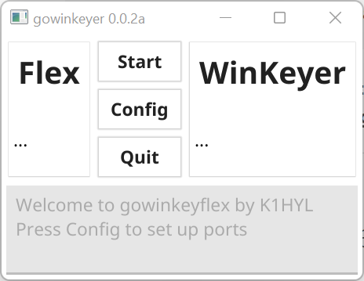
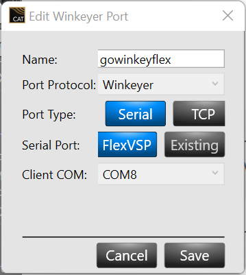
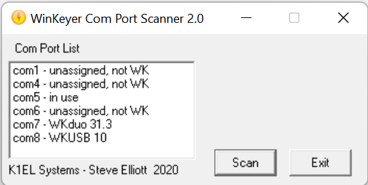
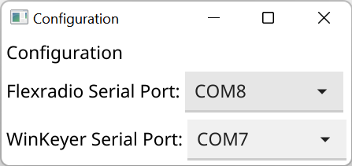
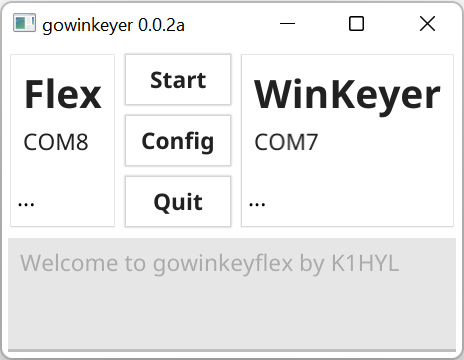
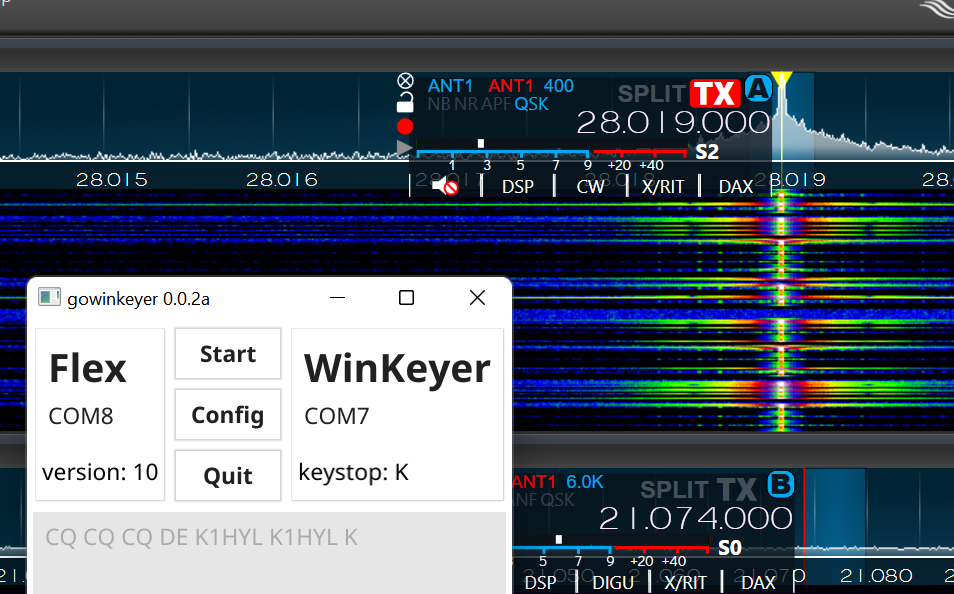

# gowinkeyflex

Small utility to relay CW commands received by a K1EL WinKeyer and send to a FlexRadio Winkeyer COM port interface.

# Installation

Click the releases section on the right, and download the latest version. Then double-click the `gowinkeyflex.exe` 
to run.



Configuration is done by clicking the `Config` button. You will need to set up your serial ports here.
Select the appropriate values. Remember to create a new Winkey port in SmartSDR CAT. You may choose any
available unused COM port, just make a note of it.



Next configure your WinKeyer port. If you don't know which one it is, you can use the vendor provided
[WinKeyer Com Port Scanner 2.0](https://www.k1elsystems.com/WKscan.html) 



I'm using a WKUSB-AF as my winkeyer device, which shows up as WKduo 31.3, or COM7.

Finally, make your config match the configuration from above.



Close the Config Window, then close the application. Restart `gowinkeyflex.exe` and you are ready.

# Usage

Execute `gowinkeyflex.exe` by double-clicking the icon. Verify your COM ports match the items you 
configured above. Click start to continue



You now should be able to relay CW from your local Winkeyer to your Flexradio. Changing the speed 
knob on the front of the keyer will change your speed on the Flex to match. Characters entered on your 
paddle will now be relayed to your Flex.



# Troubleshooting

If your radio does not key and transmit, verify your settings for your Flex Radio Winkeyer. In 
SmartSDR, make sure the radio is in CW mode and on a clear frequency. 

Timing is still a bit squirly, and I'm looking into ways of addressing it. 

# Dependencies

* [Go 1.18](https://go.dev/dl/)
* [git command line tools](https://gitforwindows.org/)

All commands to be executed in PowerShell.

# Build

Start by cloning the repository:

```powershell
git clone https://github.com/dannyquist/gowinkeyflex.git
```

Get the depedencies:

```powershell
go get -v .
```

Build the executable

```powershell
go build .
```

# Contributing

Pull requests are welcome!

# License

MIT License

Copyright (c) 2022 Danny Quist

Permission is hereby granted, free of charge, to any person obtaining a copy
of this software and associated documentation files (the "Software"), to deal
in the Software without restriction, including without limitation the rights
to use, copy, modify, merge, publish, distribute, sublicense, and/or sell
copies of the Software, and to permit persons to whom the Software is
furnished to do so, subject to the following conditions:

The above copyright notice and this permission notice shall be included in all
copies or substantial portions of the Software.

THE SOFTWARE IS PROVIDED "AS IS", WITHOUT WARRANTY OF ANY KIND, EXPRESS OR
IMPLIED, INCLUDING BUT NOT LIMITED TO THE WARRANTIES OF MERCHANTABILITY,
FITNESS FOR A PARTICULAR PURPOSE AND NONINFRINGEMENT. IN NO EVENT SHALL THE
AUTHORS OR COPYRIGHT HOLDERS BE LIABLE FOR ANY CLAIM, DAMAGES OR OTHER
LIABILITY, WHETHER IN AN ACTION OF CONTRACT, TORT OR OTHERWISE, ARISING FROM,
OUT OF OR IN CONNECTION WITH THE SOFTWARE OR THE USE OR OTHER DEALINGS IN THE
SOFTWARE.
